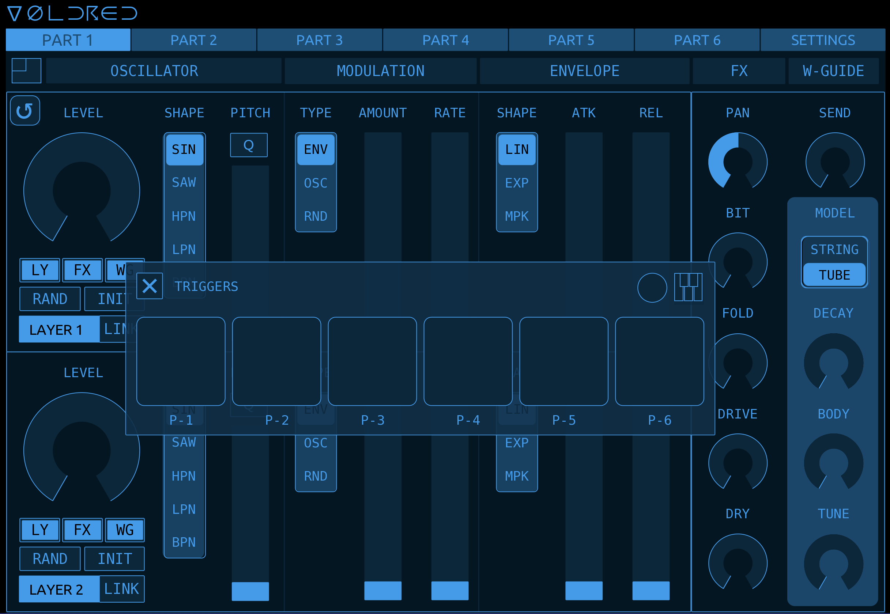
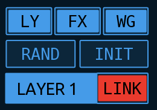
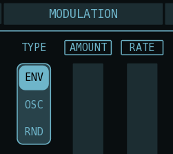
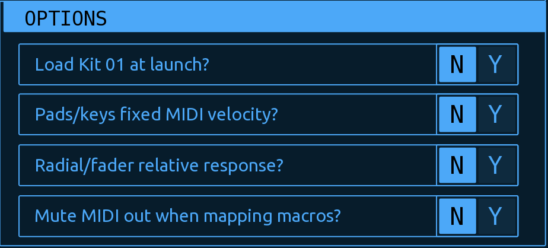

## VOLDRED : Volca Drum Editor by Neil Baldwin

VOLDRED is a Touch OSC editor for the Korg Volca Drum. It adds power, speed and convenience to your editing experience and has a ton of tricks up its sleeve to transform the sound designing process on the Volca Drum.

## Why Do I Need VOLDRED?

Let's face it, sound editing on the Volca Drum is *fiddly*. No offence, Korg. Too much menu diving, too much cycling between Parts. Too much damn scrolling through the oscillator/modulation/envelope combinations to dial in the configuration you want. And trying to do all of this via the tiny knobs and tiny screen. *Fiddly*.

VOLDRED pours petrol on that, sets it on fire then walks away in slow-motion.

* Intuitive touch-screen interface that lets you see and edit ALL Part parameters on a single screen
* Loading and saving of up to 16 "kits" that can be instantly recalled via a single click/touch and also recalled via MIDI messages. These are stored inside VOLDRED
* Copying parameters between Parts
* Sysex exporting and importing of Kits
* Edit Layers independently or linked, with the added feature that you can edit both layers simultaneously and the parameters of each layer retain their numerical relationship to each other (more on this later)
* Full randomisation. Similar to randomisation on the hardware but adds further randomisation to the FX parameters (Pan, Bit Crush, Fold etc.) and also the Waveguide parameters. Plus any parameter can easily be "locked" to prevent it being randomised
* Layers/FX/Waveguide can be instantly initialised with a single touch
* Fast switching between Parts for editing the entire kit
* Pads for MIDI triggering the six tracks (Parts)
* Mini-keyboard for playing the Volca Drum melodically or for using keyboard input to set the pitch of the oscillators
* Super-flexible mappable Macro knobs - control almost every parameter with one knob!
* Customisable colour-scheme!

## Index

* [Requirements](#requirements)
* [UI Walkthrough](#ui-walkthrough)
* * [Part Selector](#part-selector)
* * [Layer Controls](#layer-controls)
* * [Part Fx and Waveguide](#part-fx-and-waveguide)
* * [Settings](#settings-tab)
* * [Loading and Saving Kits](#loading-and-saving)
* * [UI Colours](#ui-colour-settings)
* [Setting Up and Getting Started](#setting-up-and-getting-started)
* [Editing Layer Parameters](#editing-layer-parameters)
* * [Linked Layer Editing](#layers-linked-editing)
* * [Randomisation and Initialisation](#randomisation-and-initialisation)
* * [Linked Randomisation and Initialisation](#linked-randomisation-and-initialisation)
* * [Locking Parameters From Randomisation](#locking-parameters-from-rand-and-init)
* * [Pitch and Q](#pitch-and-q)
* * [FX and Waveguide](#fx-and-waveguide)
* [Controller Window](#controller-window)
* * [Drum Pads](#drum-pads-triggers)
* * [Mini Keyboard](#mini-keyboard-pitch)
* * * [Keyboard](#keyboard)
* * * [How Does It Work?](#how-does-it-work)
* * [Macros](#macro-controls)
* * * [Macro Control Anatomy](#macro-control)
* * * [Mapping Controls To A Macro](#mapping-parameters-to-macro-controls)
* [Loading and Saving Kits](#loading-and-saving-kits)
* * [How To Load and Save](#how-to-load-and-save-in-voldred)
* * [Switch Kits Via MIDI](#switching-kits-via-midi)
* [Copying Parts](#copying-parts)
* [Sysex Backup and Restore](#sysex-backup-and-restore)
* * [Sysex Setup](#sysex-setup)
* * * [Sysex: How To Use](#sysex-how-to-use)
* * * [Sysex Sending](#sysex-sending)
* * * [Sysex Receiving](#sysex-receiving)
* [Changing the UI Colours](#changing-the-ui-colours)
* [Editor Options](#editor-options)
* [Roundup](#roundup)

## Requirements

You'll need a Volca Drum. Buy one or borrow one: it's easily one of the best of the Volca range. 

You'll also need Touch OSC, and a device to run it on. And some sort of MIDI device. And a MIDI cable. You know the score.

>[!tip]
You have to pay for Touch OSC on mobile devices but **you can download it for a free, unrestricted trial** on desktop computers. The mobile version is about $15.

If you don't already own [Touch OSC](https://hexler.net/touchosc) I can't express strongly enough how good it is. Plus, the developers, Hexler, are hardworking independent artists in their own right and these kind of people benefit from our support where we can. I am in no way affiliated to them or paid by them: they just make really good stuff for audio and visual artists.

## UI Walkthrough

### Part Selector

Across the top of the UI is the *Part Selector*.  Here you can quickly switch between Parts for editing by just tapping on a tab. This is also where you can access various settings and functions such as  [Loading and Saving Kits](#loading-and-saving-kits) via the [Settings Tab](#settings-tab)

Below the Part Selector is a heading strip showing you the different sections of each Layer etc. It doesn't do anything clever apart from give you a visual indicator of the various parameter groups.

>[!tip] 
>Switching Parts in VOLDRED does not change the selected Part on the VD.

### Layer Controls

Below the Part Selector are two identical groups of controls that contain the parameters for Layer 1 and Layer 2 of the currently selected Part.

Here you can see *Oscillator Level*, *Oscillator Shape*, *Oscillator Pitch* etc. for Layer 1. The controls for Layer 2 are identical.

The cluster of buttons below the Oscillator Level radial control various options and modes for linked editing and randomisation.  See [Layers: Linked Editing](#layers-linked-editing) and [Randomisation and Initialisation](#randomisation-and-initialisation) for more details.

The button in the top-left corner is to open the Controller Window. See [Controller Window](#controller-window) for details.

### Part FX and Waveguide

To the right side are the parameters for Part FX (Pan, Bit Crush, Drive, Waveguide Send etc.) and also the parameters for the Waveguide.

  

>[!tip]
>On the Volca Drum, both Layers share the same FX settings which is why there is only one FX section per Part. Similarly, all six Parts share the same Waveguide parameters, though each Part has its own *Waveguide Send* amount.

### Settings Tab

The last tab in the Part Selector takes you to the Settings page:

Here you can load/save kits, copy parameters between Parts, change the UI colours and set various other parameters.

#### Loading and Saving

The top section is where you can load and save kits to one of 16 slots, which are saved when you save VOLDRED's Touch OSC project file. For more details see "Loading And Saving Kits"

It's also possible to recall kits via MIDI control. See [Loading Kits Via MIDI](#loading-kits-via-midi) for an explanation.
#### Copy Parts

Immediately below the Load/Save section is the controls to copy parameter settings between Parts of the current kit.

For more details see [Copying Parts](#copying-parts)

#### Sysex Backup & Restore

Below Copy Parts are the two controls for exporting and importing your Kit data as a MIDI sysex file.

For more details see [Sysex Backup and Restore](#sysex-backup-and-restore)

#### UI Colour Settings and Editor Options

At the bottom left is where you can change the hue, saturation, lightness of the UI colour scheme. You can also change the alpha of the UI background colour. There are also several editing options you can set here. More details under [Changing the UI Colours](#changing-the-ui-colours) and [Editor Options](#editor-options)

  

## Setting Up and Getting Started

Load VOLDRED into Touch OSC and in the Connections window make sure you have a MIDI output configured to send MIDI to your Volca Drum. VOLDRED sends all of the parameter changes via MIDI messages (from the Lua scripting). It does not use OSC.

>[!tip]
>By default, VOLDRED sends MIDI to your Volca on MIDI Connection #1 (Touch OSC setup). By default it uses MIDI Connection #2 (Touch OSC setup) to send and receive sysex Kit data.

>[!important]
>Your Volca Drum must be in the default MIDI mode where the Parts are split across MIDI channels 1-6. VOLDRED won't work if your Volca Drum is in the single-channel mode.

>[!tip]
>First make sure everything is working:
>* Toggle the editor mode in Touch OSC so that you're in controller mode.
>* Tap key 1 on your Volca Drum so you can hear the sound.
>* Switch to Part 1 in VOLDRED. Use the *Oscillator Level* radial to turn up the volume of Part 1.
>* Then trying moving the *Oscillator Pitch* slider up and down. You should hear the pitch change as you're tapping the Part 1 key on the VD.
>* If you can't hear the pitch change it's most likely an issue with your MIDI Connection in Touch OSC. Double-check your MIDI settings and if you still can't get it to work then drop me a line - see the [Roundup](<#roundup>) section at the bottom of this document for contact link.

## Editing Layer Parameters

The parameters in Layer 1 and Layer 2 should be pretty obvious as they correspond to the same settings/controls on the Volca Drum hardware.

>[!tip]
>When you touch or move a control, it's name will be temporarily replaced with the current value of that control. If you have Pitch Quantization enabled (QPI) then the PITCH slider will display the current MIDI note instead of a numerical value.

>[!tip]
>Instead of having to use the Select knob on the Volca to scroll through all the combinations of *Oscillator Shape*, *Modulation Type* and *Envelope Shape*, you can just use the individual radio buttons to change those parameters directly!

The cluster of buttons below Oscillator Level won't be so obvious. They control the editing mode and also options for randomisation and initialisation of parameters.

#### Layers: Linked Editing

The default editing mode lets you edit each Layer independently. However the Layers can be *linked* while editing meaning when you change parameters on one Layer, the parameter(s) on the other Layer will also be affected.

To enable linked editing tap on the LINK icon to the right of the Layer name. It will turn red when active.

  

Depending on the state of each LINK button, linked editing behaves in two slightly different ways:

>[!important]
>**Absolute and Relative Layer Editing**
>
> There are two different modes of the linked Layer editing, **Absolute** and **Relative**
> 
> **Absolute Layer Editing**
> 
> *When both of the two Layer Link buttons are active you are editing in Absolute Mode*.
> 
> Any changes you make to the Layer that has LINK enabled will be *mirrored* to the other Layer. This works similar to when you have "LAYER 1+2" selected on the VD. Moving a control on either Layer will set the parameter on the other Layer to the same value.
> 
> **Relative Layer Editing**
> 
> *When only one of the Layer Link buttons is active you are editing in Relative Mode.*
> 
> Any changes you make to the Layer that has LINK enabled will affect the other layer but instead of setting the parameter of both Layers to the same value, in this mode the relative numerical relationship between the two layers' parameters is maintained for as long as you're touching the control. See below for an example.
> 
> Also when only one Layer Link button is active, the Layer that doesn't have LINK enabled will not affect then other Layer when you change its parameters.

*Absolute Layer Editing* should be fairly familiar as it behaves in the same way as editing the two Layers simultaneously on the VD (Layer 1+2 mode). However *Relative Layer Editing* might not be so obvious:

>[!tip]
>**Relative Layer Editing**
>
>Let's say  Layer 1 Level is set to 100 and Layer 2 Level is set to 50. If you enable the LINK button on Layer 1 (and LINK on Layer 2 is disabled) then you'll be editing in *Relative Mode*.
>
>Now move Layer 1 Level control to 75. You'll see that instead of Layer 2 Level also being set to  75, instead it has moved to 25: maintaining the original relationship between the level of each Layer.
>
>While still touching Layer 1 Level control, move it further so that Layer 2 Level goes all the way to 0. Then move Layer 1 Level back up again and you'll see that even though Layer 2 went to 0, it still maintains its original relationship to Layer 1 *at the time you touched the control*.

## Randomisation and Initialisation

The two buttons under the *Oscillator Level* control, `RAND` and `INIT` are used to randomise and initialise parameters respectively. Exactly how and what the `RAND` and `INIT` buttons affect depends on the three toggle buttons above them: `LY`, `FX` and `WG`

  

>[!tip]
>**Randomisation and Initialisation Modes**
>
>`LY` : If `LY` is enabled, when you press `RAND` or `INIT`, all the Layer parameters of the current Part will be affected.
>
>`FX` : If `FX` is enabled, when you press `RAND` or `INIT`, the controls in the FX section will be affected. Note: this includes the Waveguide Send control.
>
>`WG` : If `WG` is enabled, when you press `RAND` or `INIT` the controls in the Waveguide will be affected. Note: this does not include the Waveguide Send control.
>
>It should be obvious but you can enable/disable any combination of these three buttons to target exactly the result you want.

### Linked Randomisation and Initialisation

Similar to how the *Layer Link* button behaves when manually editing the controls, *Layer Link* also affects randomisation and initialisation. For example if you have LINK enabled on Layer 1 and you press the Layer 1 `RAND` button, the parameters in Layer 2 will also be randomised.

>[!note]
>There isn't an *Absolute* or *Relative* mode when using `RAND` or `INIT`. If a Layer Link button is active, it will affect the other Layer by either randomising or initialising its parameters too.

### Locking Parameters from RAND and INIT

There is a *hidden* feature (read: not so obvious from the UI) that enables you to lock out any number of individual parameters from being affected by `RAND` or `INIT`. Simply tap on the parameter name. If it's locked it will have a box around the text.

Here, *Modulation Type* is unlocked while *Amount* and *Rate* are locked.

  

### PITCH and Q

You'll notice above the slider that controls Oscillator Pitch, there is a toggle button labelled "Q"

  

This is to enable or disable the Volca's pitch quantisation (QPI). When disabled the oscillator pitch isn't quantised. When enabled the pitch is quantised to semi-tone intervals.

In Korg's wisdom they gave us just one Pitch Q control per Part so if you enable/disable it in one Layer, it's also enabled/disabled in the other Layer as a visual reminder that Pitch Q affects both Layers.

### Reloading Part

  

Tapping the circle-arrow button at the top-left just underneath the Part selector will reload the currently selected Part from the currently loaded Kit.

>[!note]
>Reloading the current Part will only reload Layer 1, Layer 2 and the FX parameters. Waveguide parameters will not be reloaded.

>[!tip]
>See [Loading and Saving Kits](#loading-and-saving-kits) for explanation of how to load and save kits in VOLDRED.

## FX and Waveguide

  

#### FX
Both Layers in a Part share the parameters in the FX section. These are *Pan*, *Bit Crush*, *Fold*, *Drive*, *Dry Gain* and *Send* (Send is the send amount to the Waveguide). I don't think there's anything more to say about FX.

#### Waveguide
Similar to Volca Drum FX parameters, there is only one Waveguide section which is shared by all Parts, though each Part does have its own independent Send that controls how much of the output of each Part is sent to the Waveguide processor.

The Waveguide is shown on each Part's display but if you change any of the Waveguide parameters on a Part page it applies to all Parts. I'm sure you know this as a Volca Drum user but it's worth reinforcing here as each Part might seem to have its own set of Waveguide parameters: they don't but I display the Waveguide in each Part for editing convenience.

### Alternative Radial Control

As much as I :heart_eyes: Touch OSC, I've never been a fan of the fact that the only way to move the Radial control is to rotate your touch around it. Often I find that awkward and wish there was an option to enable you to just touch and move your finger vertically (or horizontally) to change the value.

Until that time, VOLDRED has an option in [Editor Settings](#editor-options) - `Extendad Radial control?`

What this does is add an invisible overlay over the Radial controls to enable you to control the Radials by moving your finger vertically on them. Look at this image of the Oscillator Level control. I've made the overlays visible so I can explain the details:

  

When the Radial overlay are enabled, you touch the control and move your finger up or down: up increases the Radial value and down decreases it. You can see that the overlay is split into two halves. The right side is for fast/large parameter changes while the left side gives you finer, more precise control.

This is the same for all of the smaller Radial controls too (FX, Waveguide) and also applies to the Macro Radials though on the Macro Radials there is only one overlay. I did this as I feel the Macro controls are more aligned with performance rather than preceise editing: there's already plenty other ways to edit the Part parameters if you want precision.

## Controller Window

VOLDRED includes a *secret* Controller Window that combines Drum Pads, Mini Keyboard and Macro Knobs in the same floating window. To open and close it, tap on the small square icon in the top-left of Layer 1.

  

The window is a multi-function window so its appearance will depend on the last time you used it. It will either be in Drum Pad, Mini Keyboard or Macro mode.
### Drum Pads (Triggers)

In this mode, tapping on each of the pads, P-1 to P-6 will trigger the sound on those Parts (tracks) on the Volca Drum.

Velocity is mapped to the position you tap on the pad: maximum velocity is in the middle and it reduces the closer to the edge of the pad you tap.

#### Drum Pad Icon
To switch to Mini Keyboard tap the keyboard icon at the top-right.

#### Macro Icon
The circle icon takes you to the Macros but we'll look at the keyboard first.

### Mini Keyboard (Pitch)

>[!important]
>The Volca Drum does not respond to MIDI note numbers in Key-On messages. The Pitch Input keyboard works by directly setting the Oscillator Pitch parameter so just be aware that it will modify the currently selected Part.

OK so this one will take a little more explaining than the Drum Pad/Triggers mode. It was also one of my favourite VOLDRED features to realise!

I'll go over the controls first and then explain a bit more about what's actually going on:

#### Keyboard
The *keyboard* is just over 1 octave of touch pads (16 in total) starting at C and ending an octave-and-a-bit above at D#/Eb. The nearer to the bottom edge you tap, the higher the velocity.

>[!tip]
>Remember that the Volca Drum has two pitch modes: unquantised and quantised. To get proper musical semi-tone intervals on the keyboard you need to be in quantised mode by enabling the Q button above the Pitch slider. You can use the keyboard in either mode though, of course.

#### TRG (trigger)
This toggle-button controls whether the current Part is triggered as you tap the keys on the keyboard. Handy if you're modifying a Part with the sequencer running, for example, so that you can use the keyboard to change the pitch without repeatedly triggering the sound.

#### OCT (octave)
You can change the current octave of the keyboard. The current octave is displayed on the two "C" keys.

#### LYR (layer)
This radio-button toggles the target Layer between Layer 1 and Layer 2.  You might only want to affect the pitch of a single Layer so this is how you do it.

>[!tip]
>The keyboard also respects the `LINK` buttons in the Layers. If you have `LINK` on for Layer 1 and use the keyboard to send pitch information to Layer 1, the pitch of Layer 2 will also be affected *relative* to its original relationship to Layer 1. If `LINK` is on for both Layers, the same pitch will be sent to both Layers. Exactly the same way as editing parameters or using `RAND` and `INIT` functions. Super handy if you're trying to set specific intervals between the two Layers.

#### How Does It Work?
As per the comment above, the Volca Drum *does not respond to MIDI note numbers* so you have no *normal* way of triggering the sounds in a *pitched* or *melodic* way. The way the mini keyboard works in VOLDRED is by sending MIDI CC values for the Oscillator Pitch and then (optionally) triggering the currently selected Part to mimic MIDI Key-On message. It isn't perfect. The main quirk is there is some unfathomable lag or slew when you change the Oscillator Pitch parameter so it always sounds like it has some degree of pitch gliding. The other unavoidable *problem* is that in order to work it has to modify the current Part.

>[!tip]
>**Synchronised Editing Example**
>
>Let's say you wanted a melodic Part with the pitch of the two oscillators set a fifth (7 semitones) apart.
>
>Start off by initialising the two Layers of the current Part. You can either tap the `INIT` button in both parts or just use Layer 1 and enable its LINK button. For the sake of this example, enable `LY`, `FX` and `WG` before pressing `INIT` so that we have a simple, clean sound to demonstrate.
>
>Now make sure `LINK` is not enabled on either Layer and open the mini keyboard window. You'll also want to enable `Pitch Q`.
>
>Set the `LYR` number to `1` and tap the first C key. Layer 1 pitch will now be set to C. Set `LYR` to `2` now and then tap the G key. Layer 2 will now be set to G.
>
>Enable the `LINK` button on Layer 1 and set the `LYR` number back to `1`.
>
>Now when you play the keyboard you'll hear that the two Layers are always seven semitones apart.

### Macro Controls

This one will also take a bit of explaining. Settle in.

>[!note]
>There are six Macro Controls, each of which can be mapped to multiple controls. Even though there are six, the same number as there are Parts, the Macro Controls are not tied to a specific Part. For example, any Macro Control can be mapped to any number of parameters over one or more Parts and even the Waveguide.

#### Macro Control

First thing, get to know the controls of a Macro Control. Each of the 6 Macro Controls are identical.

  

##### Macro Dial
The dial in the center is what controls the output of the Macro Control. Once parameters are assigned to it, rotating the control will send values to the mapped parameters.

##### Mapping Button (+)
Tap this button to enable mapping for this Macro. When in mapping mode the Macro name (M1 in this case) will flash as a *warning* that you are in Mapping Mode. More on this below.

##### Clear Button (X)
This simply clears any mapping from the Macro.

##### Mapped Controls Indicator
The circular indicator at the top-left indicates if any parameters are currently mapped to this Macro. If it's off then this Macro has no mapped parameters. This is mainly so when looking to map parameters you can see at a glance any Macro Controls that are currently unused.

##### Dial Mode
The diamond-shaped button at the top-right controls what happens when you move (and then release) the Macro Dial. When this button is unlit, once you release your finger/mouse on the Macro Dial, the value of the dial stays where you left it. If this button is lit, when you lift off your finger the Macro Dial will snap back to zero.

#### Mapping Parameters to Macro Controls

Here's where it gets a little weird. Weird is good.

>[!TIP]
>Let's start off simple. We'll map the Oscillator Level (Part 1, Layer 1) to Macro Control M1. Have Part 1 selected and open the Controller Window and switch to Macros.
>
>* First click/press the X on Macro M1 to clear any previous mapping. If the Dial Mode button is on (the diamond button at the top-right), turn it off for the time being
>* Then click/press the + button on Macro Control M1 to enable mapping. M1 will start flashing to tell you that you are in mapping mode.
>* Now we will define the *range* of how the Macro Dial affects the Oscillator Level by moving the Level control between two points. Click somewhere near the bottom and move the control to somewhere near the top of it's range. M1 will momentarily flash to tell you that the mapping has been registered
>* Now try moving the Macro Dial and you will see Oscillator Level move through the range you just defined. The range you defined is scaled over the full range of the Macro Dial
>* This also works in both directions. For simplicity, tap the + button to stop mapping and then the X button to clear the mapping you just made
>* Now move the Oscillator Level to maximum. Re-engage mapping on M1 and this time tap-and-drag the Oscillator Level from maximum to it's minimum. Again M1 will flash to let you know the mapping was successful
>* Now when you move the Macro Dial you'll see that Oscillator Level moves in the opposite direction to the Macro Dial
>* Tap the Dial Mode (diamond) button to turn it on. You'll see that the Macro Dial snaps back to zero. Move the Macro Dial and let it go to see the behaviour in this mode.
>* Now while mapping is still enabled (M1 flashing?) add another parameter or two by tapping-and-dragging in the same way. Move the Macro Dial and see that all mapped parameters are now controlled by M1

### Wait, There's More!

I know what you're thinking: sure, that little keyboard thing is handy but it often gets in the way of the Layer controls. Well...you can move it! I know: I'm good.

If you tap-and-hold anywhere in the big empty part at the top, between the two icons, you can drag the window around and place it somewhere out of the way when you're editing parameters but still want to be able to trigger the Parts or play the Volca via the mini-keyboard.

  

>[!tip]
>**A Clever Hack!**
>
>Without going into too much explanation, you can't *really* do this in Touch OSC. You can only really move objects around when you're in Edit mode. But that's no use in this case as when you're in Edit mode you can't *use* the keyboard.
>
>So the window-dragging is a big hack I came up with. A clever hack but a hack all the same. 
>
>Because of this there is an annoying *quirk* where you're able to drag your touch/mouse pointer outside of the window when dragging and it will stop moving the window and touch/press the control that's directly under where your finger/mouse left the window. I haven't figured out a way to fix it so my advice to you is thus: don't try to drag the window around really quickly and be deliberate about where you tap-and-drag to reduce the risk of the "pop out" bug.

>[!note]
>If the keyboard window is open and you switch to the SETTING tab, the window will be hidden temporarily until you switch back to one of the six Part tabs.

## Loading and Saving Kits

A few things to get out of the way first:

* Touch OSC projects cannot save any sort of data to the host filesystem. Loading and saving inside of VOLDRED uses a clever hack (here we go again!) to store hidden data within the Touch OSC (.tosc) file itself. When you save the Touch OSC file the 'saved' data is saved with it and can be recalled when you next open the `.tosc` file.
* Volca Drum doesn't have MIDI out or any way of externally *reading* the parameters. The kit numbers within VOLDRED bear no relationship to the kit numbers in the Volca Drum.
* Consequently when you load (send) a kit from VOLDRED to the Volca Drum, the currently selected kit on the Volca Drum is temporarily modified - as if you'd instantly tweaked all the controls.

In short, VOLDRED kits exist in their own bubble inside of the Touch OSC file. Of course, you can *load* a kit in VOLDRED (sent to the VD) and then use the VD Save Kit to save the current settings to one of the 16 kits on the VD. If you don't save the kit on the VD, then you power it off or change kits on the VD, whatever you sent from VOLDRED will be lost (though still inside VOLDRED of course). I'm probably making this seem more complicated than it is.

The other thing to bear in mind is loading and saving PRGs on the VD. When you change PRGs the kit with the same number as the PRG is loaded. This works slightly differently from loading a kit (on the VD) as you can load any of the 16 kits and keep the same PRG sequence. You'll know this if you're a seasoned VD user but it's worth mentioning here as it has implications on VOLDRED's loading of kits: if you send a kit from VOLDRED and then change PRGs, the VD's kit will change also.

### How To Load and Save in VOLDRED

With all that out of the way you'll be reassured to know that actually loading and saving inside VOLDRED is fast, convenient and intuitive. To access loading and saving go to the SETTINGS tab.

#### Slots
The 16 numbered boxes across the display are your kit *slots*. To *load* one just tap it. It will load pretty instantly and you'll get a message in the status box (the text box above) telling you it loaded.

If you look directly underneath each slot there is a small rectangular indicator. If this is on/filled it means a kit is saved in that slot. If it's off/unfilled that means the slot is empty. If you try to load an empty slot you'll get an error message telling you that nothing was loaded.

#### Saving
To *save* the current kit to a slot, first tap on the `SAVE` button. It will turn red indicating that it's waiting for you to select a slot. Tap a slot to save. If you change your mind, tap the `SAVE` button again to cancel the save operation.

#### Clear
The `CLEAR` button will clear the currently selected slot. There's no undo but if you've just selected a slot to clear it, that slot will still be *loaded*. So, if you accidentally clear a slot, just save it again. If you try to tap `CLEAR` while `SAVE` is active you'll get an error message telling you to cancel `SAVE` before you can `CLEAR` the slot.

#### Switching Kits Via MIDI
It's also possible to recall Kits using MIDI control. Sending a Program Change message on Channel 1 to VOLDRED (inside Touch OSC) with the program change number 1 to 16 will recall the corresponding Kit. If the slot you try to recall is empty it will just fail silently and leave the current kit intact.

## Copying Parts

This should be fairly self-explanatory. You select the source Part on the left and the destination Part on the right then tap `COPY` to copy the parameters from one to the other.

The `L1`, `L2` and `FX` buttons in the middle are toggles to let you filter what parameter groups are copied:

* `L1` means everything from Layer 1 is copied when `COPY` is pressed
* `L2` means everything from Layer 2 is copied when `COPY` is pressed
* `FX` means the FX parameters are copied when `COPY` is pressed

There's no option for copying Waveguide parameters are they're common to all Parts.

It should be obvious but you can select any combination of `L1`, `L2` and `FX` to copy exactly the parameters you want.

## Sysex Backup and Restore

>[!warning]
>The sysex features are a relatively new addition to VOLDRED and have only received minimal testing and usage. Nothing should really *break* but...you know...

As well as storing the 16 kits inside of the the .TOSC file when you save it, I recently added the ability to export and import Kit data from VOLDRED!

### Sysex Setup

>[!tip]
>VOLDRED always attempts to communicate with your **Volca Drum** via MIDI on the **first MIDI connection** (in Touch OSC setup).
>
>VOLDRED always attempts to **send and receive sysex data** via MIDI on the **second MIDI connection** (in Touch OSC setup).
>
>This is my own setup to illustrate:
>
>
>
>Here you can see that MIDI connection 1 is set to send and receive on my Zoom L6 interface (which is what I have the Volca MIDI connected to). MIDI connection 2 is set to "IAC Driver Bus" which is an internal MIDI connection on OSX.
>
>I then have a free sysex tool (OSX) called "Sysex Librarian" (there are Windows/Linux equivalents I'm sure):
>
>

### Sysex: How To Use

As mentioned above, you'll need some sort of sysex librarian/tool software/app to receive and send the sysex data. I use "Sysex Librarian" on OSX (free) so find one for your own platform/setup. Once you've setup the MIDI connections in Touch OSC as detailed above, actually using the send and receive controls is very straightforward. I'll describe the process in relation to Sysex Librarian but I'm sure other software have a similar method.

#### Sysex Sending

On Sysex Librarian you have to click on "Record One" to engage receiving. Once it's waiting for sysex data, go to VOLDRED and tap on the `[SEND]` button:

Your Kit data will be sent to Sysex Librarian and the file will appear in the app's library as an unnamed file. From there you can either leave it in the internal library or export it as a .syx or .mid file. This is useful is you want to send or share your Kit sysex or move it to another device etc.

#### Sysex Receiving

To import a sysex Kit you first need to engage the `[RECEIVE]` button. When VOLDRED is waiting for sysex data the receive button will be coloured red.

Go to Sysex Librarian, select a previously exported Kit file and click on the Play button (or double-click the file in the library list). The sysex data will be received by VOLDRED and then decoded into the 16 kit slots.

>[!note]
>After importing via sysex, no Kit is 'loaded' to the editor or your Volca so you need to click on one of the Kit Slot to actually load a Kit and send it to your Volca.

>[!important]
>At the date of writing this I haven't found a way to send and receive sysex data from VOLDRED on iPad to another app running on the iPad. I've tried a few but none seem to work.
>
>However there is a way to do it via Network MIDI if you have an iPad and a MacOS computer.
>
>First setup a MIDI Network session via "Audio MIDI Setup"
>
>
>
>Then create a new session and when your iPad appears select it and click on "Connect"
>
>
>
>Then in your sysex librarian (Sysex Librarian here), simply change the MIDI device to the network session you just created:
>
>
>
>You should now be able to send and receive sysex from VOLDRED as though the devices were physically connected.

## Changing the UI Colours

  

On the `SETTINGS` tab you can completely alter the entire colour scheme for VOLDRED.

The section on the left, `UI ELEMENTS`, is just a bunch of dummy objects so you can see how the colour changes affect different aspects of the VOLDRED UI.

On the right are four sliders, H (hue), S (saturation), L (lightness) and A (background alpha). Slide these around until you get your perfect colour scheme!

  

  

  

## Editor Options

  

These may change in future updates (added to) but currently there's just four options:

#### Load Kit 01 at Launch
A convenience option to have VOLDRED send the kit in slot 01 to your Volca Drum when you run VOLDRED.

#### Pads/Keys Fixed MIDI Velocity
By default, the position you tap on the pads and keys in the keyboard window determines the MIDI velocity of the triggered sound. If you'd rather this didn't happen you can have the velocity fixed.

#### Radial/Fader Relative Response
This option switches between the two response modes of the Touch OSC controls. The default is absolute which will set the current value of the control to wherever you touch it. In relative mode you can click/touch anywhere on the control and the value won't change until you drag your finger/mouse. Just an editing preference really.

#### Extended Radial Control
This option turns on the invisible overlays for all of the Radial-style controls so that you can use your finger to swip up or down to change the value rather than having to rotate your finger around the Radial. The overlay is split into two halves: the right side gives you faster/coarser control while the left side allows you finer and more precise control.

This also applies to the Macro Radial controls though there is only a single overlay for these as the Macro window is more of a performance feature rather than something you'd use for finer editing.

#### Mute MIDI When Mapping
When you're setting the control range for macro mapping, by default the control you're adding to the macro map will send out MIDI data to your Volca just as if you were using the control normally. Sometimes this is handy but sometimes you might want to *silently* set the macro range. Turn this on and when you're setting the range, the control you're mapping won't send out MIDI data. Note this is only while mapping is active. MIDI function will be resumed if either the Macro window is closed or none of the six macro controls are in mapping mode.

## Roundup

I guess the important thing to remember is to save the VOLDRED .tosc file - if you don't do that then all your editing and saved kits will be lost. It's far from ideal but there's no way to get around that limitation, mostly due to the lack of MIDI Out on the Volca Drum (and thus the ability to read/dump the kits from it).

The other big restriction is the inability for Touch OSC to access the host's filesystem. I've tried (and I think it's pretty successful!) to compensate for this viw the sysex exporting and importing of Kit data. How useful that will be to you will very much depend on your own system and setup, especially the lack of a in-the-box solution for iPad. And though I can make it work for me using Sysex Librarian and wireless networked MIDI to my Macbook, I don't own a Windows or Linux machine that I can test on. Worst case: keep saving the .TOSC file and save multiple versions for different kits.

I genuinely hope you find it useful and creatively inspiring. Once you get the hang of using it there's a lot of fun things you can do.

## Technical Stuff

Due to the nature of Touch OSC files and the Lua scripting you can freely poke around inside the project and see how I did stuff. Most of the scripting is done in the root of the project file.

If you've any questions or issues or suggestions, drop me a line at info@marmotaudio.co.uk

Neil
