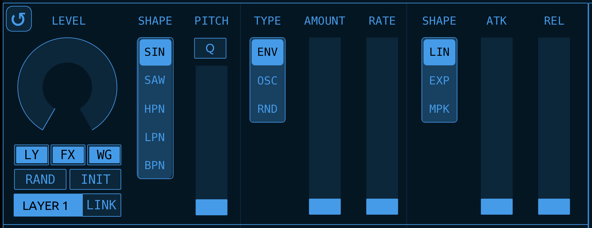
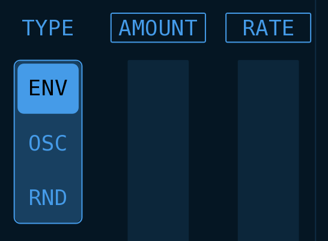

## VOLDRED : Volca Drum Editor by Neil Baldwin, 2025

VOLDRED is a Touch OSC editor for the Korg Volca Drum. It adds power, speed and convenience to your editing experience and has a ton of tricks up its sleeve to transform the sound designing process on the Volca Drum.

## Index

[Requirements](#Requirements)
[Why Do I Need VOLDRED?](#Why%20Do%20I%20Need%20VOLDRED?)
[UI Walkthrough](#UI%20Walkthrough)
	[Part Selector](#Part%20Selector)
	[Layer Controls](#Layer%20Controls)
	[Part FX and Waveguide](#Part%20FX%20and%20Waveguide)
	[Settings Tab](#Settings%20Tab)
	[Loading and Saving](#Loading%20and%20Saving)
	[Copy Parts](#Copy%20Parts)
	[UI Colour Settings](#UI%20Colour%20Settings)
[Setting Up and Getting Started](#Setting%20Up%20and%20Getting%20Started)
[Editing Layer Parameters](#Editing%20Layer%20Parameters)
	[Layers: Linked Editing](#Layers%20Linked%20Editing)
	[Randomisation and Initialisation](#Randomisation%20and%20Initialisation)
	[Locking Parameters from RAND and INIT](#Locking%20Parameters%20from%20RAND%20and%20INIT)
[PITCH and Q](#PITCH%20and%20Q)
[FX and Waveguide](#FX%20and%20Waveguide)
[Waveguide](#Waveguide)
[Drum Pads and Mini Keyboard](#Drum%20Pads%20and%20Mini%20Keyboard)
	[Drum Pads (Triggers)](#Drum%20Pads%20(Triggers))
	[Mini Keyboard (Pitch)](#Mini%20Keyboard%20(Pitch))
		[Keyboard](#Keyboard)
		[TRG (trigger)](#TRG%20(trigger))
		[OCT (octave)](#OCT%20(octave))
		[LYR (layer)](#LYR%20(layer))
		[How Does It Work?](#How%20Does%20It%20Work?)
[Loading and Saving Kits](#Loading%20and%20Saving%20Kits)
	[How To Load and Save in VOLDRED](#How%20To%20Load%20and%20Save%20in%20VOLDRED)
	[Slots](#Slots)
	[Saving](#Saving)
	[Clear](#Clear)
	[Loading Kits Via MIDI](#Loading%20Kits%20Via%20MIDI)
[Copying Parts](#Copying%20Parts)
[Changing the UI Colours](#Changing%20the%20UI%20Colours)
[Roundup](#Roundup)

---
## Requirements

You'll need a Volca Drum. Buy one or borrow one: it's easily one of the best of the Volca range. 

You'll also need Touch OSC, and a device to run it on. And some sort of MIDI device. And a MIDI cable. You know the score.

> [!NOTE] Touch OSC
> You have to pay for Touch OSC on mobile devices but **you can download it for a free, unrestricted trial** on desktop computers. The mobile version is about $15.

If you don't already own [Touch OSC](https://hexler.net/touchosc) I can't express strongly enough how good it is. Plus, the developers, Hexler, are hardworking independent artists in their own right and these kind of people benefit from our support where we can. I am in no way affiliated to them or paid by them: they just make really good stuff for audio and visual artists.

### Why Do I Need VOLDRED?

Let's face it, sound editing on the Volca Drum is *fiddly*. No offence, Korg. Too much menu diving, too much cycling between Parts. Too much damn scrolling through the oscillator/modulation/envelope combinations to dial in the configuration you want. And trying to do all of this via the tiny knobs and tiny screen. *Fiddly*.

VOLDRED pours petrol on that, sets it on fire then walks away in slow-motion.

* Intuitive touch-screen interface that lets you see and edit ALL Part parameters on a single screen
* Loading and saving of up to 16 "kits" that can be instantly recalled via a single click/touch and also recalled via MIDI messages. These are stored inside VOLDRED
* Copying parameters between Parts
* Edit Layers independently or linked, with the added feature that you can edit both layers simultaneously and the parameters of each layer retain their numerical relationship to each other (more on this later)
* Full randomisation. Similar to randomisation on the hardware but adds further randomisation to the FX parameters (Pan, Bit Crush, Fold etc.) and also the Waveguide parameters. Plus any parameter can easily be "locked" to prevent it being randomised
* Layers/FX/Waveguide can be instantly initialised with a single touch
* Fast switching between Parts for editing the entire kit
* Pads for MIDI triggering the six tracks (Parts) and also a mini-keyboard for playing the Volca Drum melodically or for using keyboard input to set the pitch of the oscillators
* Customisable colour-scheme!

---
## UI Walkthrough

### Part Selector

Across the top of the UI is the *Part Selector*.  Here you can quickly switch between Parts for editing by just tapping on a tab. This is also where you can access various settings and functions such as  [Loading and Saving Kits](#Loading%20and%20Saving%20Kits) via the [Settings Tab](#Settings%20Tab)

Below the Part Selector is a heading strip showing you the different sections of each Layer etc. It doesn't do anything clever apart from give you a visual indicator of the various parameter groups.

>[!info] Note: Switching Parts in VOLDRED does not change the selected Part on the VD.
### Layer Controls

Below the Part Selector are two identical groups of controls that contain the parameters for Layer 1 and Layer 2 of the currently selected Part.

Here you can see *Oscillator Level*, *Oscillator Shape*, *Oscillator Pitch* etc. for Layer 1. The controls for Layer 2 are identical.

The cluster of buttons below the Oscillator Level radial control various options and modes for linked editing and randomisation.  See [Layers: Linked Editing](#Layers%20Linked%20Editing) and [Randomisation and Initialisation](#Randomisation%20and%20Initialisation) for more details.
### Part FX and Waveguide

To the right side are the parameters for Part FX (Pan, Bit Crush, Drive, Waveguide Send etc.) and also the parameters for the Waveguide.

>[!info] On the Volca Drum, both Layers share the same FX settings which is why there is only one FX section per Part. Similarly, all Parts share the same Waveguide parameters, though each Part has its own *Waveguide Send* amount.

### Settings Tab

The last tab in the Part Selector takes you to the Settings page:

Here you can load/save kits, copy parameters between Parts, change the UI colours and set various other parameters.
#### Loading and Saving

The top section is where you can load and save kits to one of 16 slots, which are saved when you save VOLDRED's Touch OSC project file. For more details see "Loading And Saving Kits"

It's also possible to recall kits via MIDI control. See [Loading Kits Via MIDI](#Loading%20Kits%20Via%20MIDI) for an explanation.
#### Copy Parts

Immediately below the Load/Save section is the controls to copy parameter settings between Parts of the current kit.

For more details see [Copying Parts](Projects/Touch%20OSC/Volca/VOLDRED/readme.md#Copying%20Parts)
#### UI Colour Settings

At the bottom left is where you can change the hue, saturation, lightness of the UI colour scheme. You can also change the alpha of the UI background colour. More details under [Changing the UI Colours](#Changing%20the%20UI%20Colours)

---
## Setting Up and Getting Started

Load VOLDRED into Touch OSC and in the Connections window make sure you have a MIDI output configured to send MIDI to your Volca Drum. VOLDRED sends all of the parameter changes via MIDI messages (from the Lua scripting). It does not use OSC.

>[!info] By default, VOLDRED sends MIDI to all enabled Touch OSC MIDI Connections.

>[!warning] Your Volca Drum must be in the default MIDI mode where the Parts are split across MIDI channels 1-6. VOLDRED won't work if your Volca Drum is in the single-channel mode.

>[!example] Check Everything Is Working
>* Toggle the editor mode in Touch OSC so that you're in controller mode.
>* Tap key 1 on your Volca Drum so you can hear the sound.
>* Switch to Part 1 in VOLDRED. Use the *Oscillator Level* radial to turn up the volume of Part 1.
>* Then trying moving the *Oscillator Pitch* slider up and down. You should hear the pitch change as you're tapping the Part 1 key on the VD.
>* If you can't hear the pitch change it's most likely an issue with your MIDI Connection in Touch OSC. Double-check your MIDI settings and if you still can't get it to work then drop me a line - see the [Roundup](#Roundup) section at the bottom of this document for contact link.

---
## Editing Layer Parameters

The parameters in Layer 1 and Layer 2 should be pretty obvious as they correspond to the same settings/controls on the Volca Drum hardware.

>[!info] When you touch or move a control, it's name will be temporarily replaced with the current value of that control.

>[!tip] Instead of having to use the Select knob on the Volca to scroll through all the combinations of *Oscillator Shape*, *Modulation Type* and *Envelope Shape*, you can just use the individual radio buttons to change those parameters directly!

The cluster of buttons below Oscillator Level won't be so obvious. They control the editing mode and also options for randomisation and initialisation of parameters.
#### Layers: Linked Editing

The default editing mode lets you edit each Layer independently. However the Layers can be *linked* while editing meaning when you change parameters on one Layer, the parameter(s) on the other Layer will also be affected.

To enable linked editing tap on the LINK icon to the right of the Layer name. It will turn red when active.

Depending on the state of each LINK button, linked editing behaves in two slightly different ways:

>[!info] Linked and Synched Layer Editing
> There are two different modes of the linked Layer editing. I call them *Linked* and *Synced*.
> 
> *Synced Layer Editing*
> ==**When both of the two Layer Link buttons are active you are editing in *Synced Mode***==.
> Any changes you make to the Layer that has LINK enabled will be *mirrored* to the other Layer. This works similar to when you have "LAYER 1+2" selected on the VD. Moving a control on either Layer will set the parameter on the other Layer to the same value.
> 
> *Linked Layer Editing*
> ==**When only one of the Layer Link buttons is active you are editing in *Linked Mode*.**==
> Any changes you make to the Layer that has LINK enabled will affect the other layer but instead of setting the parameter of both Layers to the same value, in this mode the relative numerical relationship between the two layers' parameters is maintained for as long as you're touching the control. See below for an example.
> 
> Also when only one Layer Link button is active, the Layer that doesn't have LINK enabled will not affect then other Layer when you change the parameters.

*Synced Layer Editing* should be fairly familiar as it behaves in the same way as editing the two Layers simultaneously on the VD (Layer 1+2 mode). However *Linked Layer Editing* might not be so obvious:

>[!example] Linked Layer Editing
>Let's say  Layer 1 Level is set to 100 and Layer 2 Level is set to 50. If you enable the LINK button on Layer 1 (and LINK on Layer 2 is disabled) then you'll be editing in *Linked Mode*.
>
>Now move Layer 1 Level control to 75. You'll see that instead of Layer 2 Level also being set to  75, instead it has moved to 25: maintaining the original relationship between the level of each Layer.
>
>While still touching Layer 1 Level control, move it further so that Layer 2 Level goes all the way to 0. Then move Layer 1 Level back up again and you'll see that even though Layer 2 went to 0, it still maintains its original relationship to Layer 1 *at the time you touched the control*.

## Randomisation and Initialisation

The two buttons under the *Oscillator Level* control, `RAND` and `INIT` are used to randomise and initialise parameters respectively. Exactly how and what the `RAND` and `INIT` buttons affect depends on the three toggle buttons above them: `LY`, `FX` and `WG`

>[!info] Randomisation and Initialisation Modes
>`LY` : If `LY` is enabled, when you press `RAND` or `INIT`, all the Layer parameters of the current Part will be affected.
>
>`FX` : If `FX` is enabled, when you press `RAND` or `INIT`, only the controls in the FX section will be affected. Note: this includes the Waveguide Send control.
>
>`WG` : If `WG` is enabled, when you press `RAND` or `INIT` only the controls in the Waveguide will be affected. Note: this does not include the Waveguide Send control.
>
>It should be obvious but you can enable/disable any combination of these three toggles to get exactly the result you want.

### Linked Randomisation and Initialisation

Similar to how the *Layer Link* button behaves when manually editing the controls, *Layer Link* also affects randomisation and initialisation. For example if you have LINK enabled on Layer 1 and you press the Layer 1 `RAND` button, the parameters in Layer 2 will also be randomised.

>[!note] There isn't a *Linked* and *Synced* mode when using `RAND` or `INIT`. If a Layer Link button is active, it will affect the other Layer by either randomising or initialising it's parameters.

### Locking Parameters from RAND and INIT

There is a *hidden* feature (read: not so obvious from the UI) that enables you to lock out any number of individual parameters from being affected by `RAND` or `INIT`. Simply tap on the parameter name. If it's locked it will have a box around the name.

Here, *Modulation Type* is unlocked while *Amount* and *Rate* are locked.

---
### PITCH and Q

You'll notice above the slider that controls Oscillator Pitch, there is a toggle button labelled "Q"

This is to enable or disable the Volca's pitch quantisation. When disabled the oscillator pitch isn't quantised. When enabled the pitch is quantised to semi-tone intervals.

In Korg's wisdom they gave us just one Pitch Q control per Part so if you enable/disable it in one Layer, it's also enabled/disabled in the other Layer as a visual reminder that Pitch Q affects both Layers.

---
## FX and Waveguide

#### FX
Both Layers in a Part share the parameters in the FX section. These are *Pan*, *Bit Crush*, *Fold*, *Drive*, *Dry Gain* and *Send* (Send is the send amount to the Waveguide). I don't think there's anything more to say about FX.

#### Waveguide
Similar to Volca Drum FX parameters, there is only one Waveguide section which is shared by all Parts, though each Part does have its own independent Send that controls how much of the output of each Part is sent to the Waveguide processor.

The Waveguide is shown on each Part's display but if you change any of the Waveguide parameters on a Part page it applies to all Parts. I'm sure you know this as a Volca Drum user but it's worth reinforcing here as each Part might seem to have its own set of Waveguide parameters: they don't but I display the Waveguide in each Part for editing convenience.

---
## Drum Pads and Mini Keyboard

VOLDRED includes a *secret* Drum Pads and Mini Keyboard window. To open and close it, tap on the small square icon to the left of the OSCILLATOR heading.

The window is a dual-function window so its appearance will depend on the last time you used it. It will either be in Drum Pad or Mini Keyboard mode.
### Drum Pads (Triggers)

In this mode, tapping on each of the pads, P-1 to P-6 will trigger the sound on those Parts (tracks) on the Volca Drum.

Velocity is mapped to the position you tap on the pad: maximum velocity is in the middle and it reduces the closer to the edge of the pad you tap.

The `[X]` button closes the window. The small keyboard-looking icon at the top-right switches to the *Mini Keyboard* mode.
### Mini Keyboard (Pitch)

>[!question] The Volca Drum does not respond to MIDI note numbers in Key-On messages. The Pitch Input keyboard works by directly setting the Oscillator Pitch parameter so just be aware that it will modify the currently selected Part.

OK so this one will take a little more explaining than the Drum Pad/Triggers mode. It was also one of my favourite VOLDRED features to realise!

I'll go over the controls first and then explain a bit more about what's actually going on:
#### Drum Pad Icon
The small drum pad icon at the top-right will take you back to the *Drum Pad* mode. You see?
#### Keyboard
The *keyboard* is just over 1 octave of touch pads (16 in total) starting at C and ending an octave-and-a-bit above at D#/Eb. The nearer to the bottom edge you tap, the higher the velocity.

>[!tip] Remember that the Volca Drum has two pitch modes: unquantised and quantised. To get proper musical semi-tone intervals on the keyboard you need to be in quantised mode by enabling the Q button above the Pitch slider. You can use the keyboard in either mode though, of course.
#### TRG (trigger)
This toggle-button controls whether the current Part is triggered as you tap the keys on the keyboard. Handy if you're modifying a Part with the sequencer running, for example, so that you can change the pitch without repeatedly triggering the sound.
#### OCT (octave)
You can change the current octave of the keyboard. The current octave is displayed on the two "C" keys.
#### LYR (layer)
This radio-button toggles the target Layer between Layer 1 and Layer 2.  You might only want to affect the pitch of a single Layer so this is how you do it.

>[!success] The keyboard also respects the `LINK` buttons in the Layers. If you have `LINK` on for Layer 1 and use the keyboard to send pitch information to Layer 1, the pitch of Layer 2 will also be affected *relative* to its original relationship to Layer 1. If `LINK` is on for both Layers, the same pitch will be sent to both Layers. Exactly the same way as editing parameters or using `RAND` and `INIT` functions. Super handy if you're trying to set specific intervals between the two Layers.

#### How Does It Work?
As per the comment above, the Volca Drum *does not respond to MIDI note numbers* so you have no *normal* way of triggering the sounds in a *pitched* or *melodic* way. The way the mini keyboard works in VOLDRED is by sending MIDI CC values for the Oscillator Pitch and then (optionally) triggering the currently selected Part to mimic MIDI Key-On message. It isn't perfect. The main quirk is there is some unfathomable lag or slew when you change the Oscillator Pitch parameter so it always sounds like it has some degree of pitch gliding. The other unavoidable *problem* is that in order to work it has to modify the current Part.

>[!example] Example
>Let's say you wanted a melodic Part with the pitch of the two oscillators set a fifth (7 semitones) apart.
>
>Start off by initialising the two Layers of the current Part. You can either tap the `INIT` button in both parts or just use Layer 1 and enable its LINK button. For the sake of this example, enable `LY`, `FX` and `WG` before pressing `INIT` so that we have a simple, clean sound to demonstrate.
>
>Now make sure `LINK` is not enabled on either Layer and open the mini keyboard window. You'll also want to enable `Pitch Q`.
>
>Set the `LYR` number to `1` and tap the first C key. Layer 1 pitch will now be set to C. Set `LYR` to `2` now and then tap the G key. Layer 2 will now be set to G.
>
>Enable the `LINK` button on Layer 1 and set the `LYR` number back to `1`.
>
>Now when you play the keyboard you'll hear that the two Layers are always seven semitones apart.

### Wait, There's More!

I know what you're thinking: sure, that little keyboard thing is handy but it often gets in the way of the Layer controls. Well...you can move it! I know: I'm good.

If you tap-and-hold anywhere in the big empty part at the top, between the two icons, you can drag the window around and place it somewhere out of the way when you're editing parameters but still want to be able to trigger the Parts or play the Volca via the mini-keyboard.

>[!warning] A Clever Hack!
>Without going into too much explanation, you can't *really* do this in Touch OSC. You can only really move objects around when you're in Edit mode. But that's no use in this case as when you're in Edit mode you can't *use* the keyboard.
>
>So the window-dragging is a big hack I came up with. A clever hack but a hack all the same. 
>
>Because of this there is an annoying *quirk* where you're able to drag your touch/mouse pointer outside of the window when dragging and it will stop moving the window and touch/press the control that's directly under where your finger/mouse left the window. I haven't figured out a way to fix it so my advice to you is thus: don't try to drag the window around really quickly and be deliberate about where you tap-and-drag to reduce the risk of the "pop out" bug.

>[!note] If the keyboard window is open and you switch to the SETTING tab, the window will be closed.

---
## Loading and Saving Kits

A few things to get out of the way first:

* Touch OSC projects cannot save any sort of data to the host filesystem. Loading and saving inside of VOLDRED uses a clever hack (here we go again!) to store hidden data within the Touch OSC (.tosc) file itself. When you save the Touch OSC file the 'saved' data is saved with it and can be recalled when you next open the `.tosc` file.
* Volca Drum doesn't have MIDI out or any way of externally *reading* the parameters. The kit numbers within VOLDRED bear no relationship to the kit numbers in the Volca Drum.
* Consequently when you load (send) a kit from VOLDRED to the Volca Drum, the currently selected kit on the Volca Drum is temporarily modified - as if you'd instantly tweaked all the controls.

In short, VOLDRED kits exist in their own bubble inside of the Touch OSC file. Of course, you can *load* a kit in VOLDRED (sent to the VD) and then use the VD Save Kit to save the current settings to one of the 16 kits on the VD. If you don't save the kit on the VD, then you power it off or change kits on the VD, whatever you sent from VOLDRED will be lost (though still inside VOLDRED of course). I'm probably making this seem more complicated than it is.

The other thing to bear in mind is loading and saving PRGs on the VD. When you change PRGs the kit with the same number as the PRG is loaded. This works slightly differently from loading a kit (on the VD) as you can load any of the 16 kits and keep the same PRG sequence. You'll know this if you're a seasoned VD user but it's worth mentioning here as it has implications on VOLDRED's loading of kits: if you send a kit from VOLDRED and then change PRGs, the VD's kit will change also.
### How To Load and Save in VOLDRED

With all that out of the way you'll be reassured to know that actually loading and saving inside VOLDRED is fast, convenient and intuitive. To access loading and saving go to the SETTINGS tab.

#### Slots
The 16 numbered boxes across the display are your kit *slots*. To *load* one just tap it. It will load pretty instantly and you'll get a message in the status box (the text box above) telling you it loaded.

If you look directly underneath each slot there is a small rectangular indicator. If this is on/filled it means a kit is saved in that slot. If it's off/unfilled that means the slot is empty. If you try to load an empty slot you'll get an error message telling you that nothing was loaded.
#### Saving
To *save* the current kit to a slot, first tap on the `SAVE` button. It will turn red indicating that it's waiting for you to select a slot. Tap a slot to save. If you change your mind, tap the `SAVE` button again to cancel the save operation.
#### Clear
The `CLEAR` button will clear the currently selected slot. There's no undo but if you've just selected a slot to clear it, that slot will still be *loaded*. So, if you accidentally clear a slot, just save it again. If you try to tap `CLEAR` while `SAVE` is active you'll get an error message telling you to cancel `SAVE` before you can `CLEAR` the slot.
#### Loading Kits Via MIDI
It's also possible to recall Kits using MIDI control. Sending a Program Change message on Channel 1 to VOLDRED (inside Touch OSC) with the program change number 1 to 16 will recall the corresponding Kit. If the slot you try to recall is empty it will just fail silently and leave the current kit intact.

---
## Copying Parts

This should be fairly self-explanatory. You select the source Part on the left and the destination Part on the right then tap `COPY` to copy the parameters from one to the other.

The `L1`, `L2` and `FX` buttons in the middle are toggles to let you filter what parameter groups are copied:

* `L1` means everything from Layer 1 is copied when `COPY` is pressed
* `L2` means everything from Layer 2 is copied when `COPY` is pressed
* `FX` means the FX parameters are copied when `COPY` is pressed

There's no option for copying Waveguide parameters are they're common to all Parts.

It should be obvious but you can select any combination of `L1`, `L2` and `FX` to copy exactly the parameters you want.

---
## Changing the UI Colours

On the `SETTINGS` tab you can completely alter the entire colour scheme for VOLDRED.

The section on the left, `UI ELEMENTS`, is just a bunch of dummy objects so you can see how the colour changes affect different aspects of the VOLDRED UI.

On the right are four sliders, H (hue), S (saturation), L (lightness) and A (background alpha). Slide these around until you get your perfect colour scheme!

---
## Miscellaneous Options

These may change in future updates (added to) but currently there's just two options:
#### Load Kit 01 at Launch
A convenience option to have VOLDRED send the kit in slot 01 to your Volca Drum when you run VOLDRED.
#### Pads/Keys Fixed MIDI Velocity
By default, the position you tap on the pads and keys in the keyboard window determines the MIDI velocity of the triggered sound. If you'd rather this didn't happen you can have the velocity fixed.

---
## Roundup

I guess the important thing to remember is to save the VOLDRED .tosc file - if you don't do that then all your editing and saved kits will be lost. It's far from ideal but there's no way to get around that limitation, mostly due to the lack of MIDI Out on the Volca Drum (and thus the ability to read/dump the kits from it).

The other big restriction is that you can't really export the saved slots from VOLDRED so it's almost impossible to transfer your kits from one .tosc file to another. I do actually have a few ideas how this might be possible (secret: the kits are stored in hidden text boxes inside VOLDRED so you can actually copy and paste the text from one slot to another. I don't recommend it though, just yet.)

I genuinely hope you find it useful and creatively inspiring. Once you get the hang of using it there's a lot of fun things you can do.
## Technical Stuff

Due to the nature of Touch OSC files and the Lua scripting you can freely poke around inside the project and see how I did stuff. Most of the scripting is done in the root of the project file.

If you've any questions or issues or suggestions, drop me a line at info@marmotaudio.co.uk

Neil

